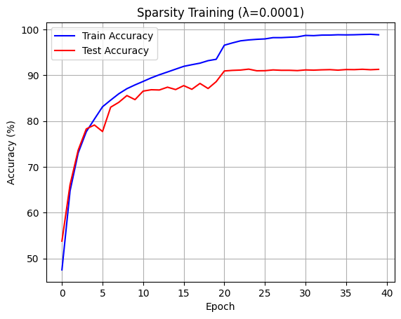
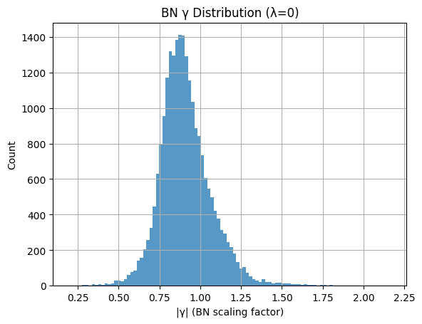
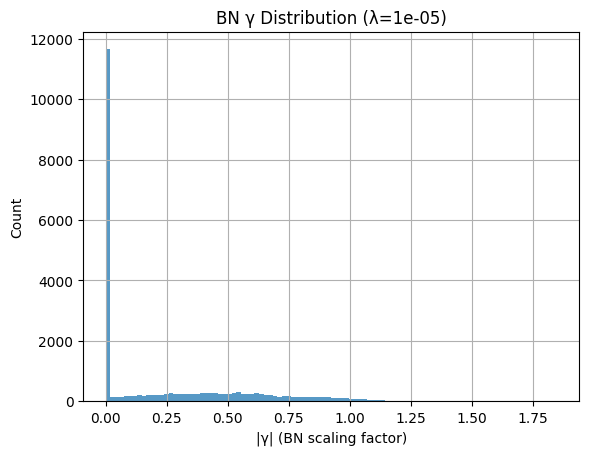
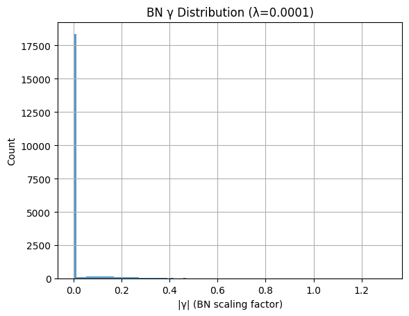
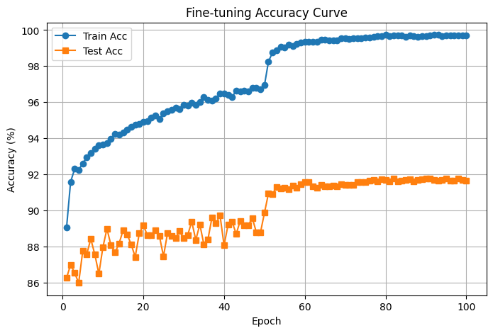

# **Lab 2 Report — Channel Pruning and Fine-tuning on ResNet**

---

## **1. Train/Test Accuracy of Original Model in Sparsity Training (λ = 1e−4)**

在 sparsity training 階段，我對原始 ResNet 模型加入 BN γ 的 L1 正則化項以產生稀疏性，
此部分的目的是觀察在 λ = 1e−4 下，模型在訓練過程中的準確率變化。

> 📈 _Figure 1. Train/Test Accuracy during sparsity training (λ = 1e−4)_



| Epoch | Train Acc (%) | Test Acc (%) |
| :---- | ------------: | -----------: |
| 10    |         88.65 |         86.5 |
| 20    |         96.55 |         90.9 |
| 30    |         98.69 |         91.2 |
| 39    |         98.83 |         91.3 |

---

## **2. Scaling Factor (γ) Distribution under Different λ Values**

為比較不同正則化強度對稀疏化效果的影響，請繪製各層 BN γ 的分布直方圖。
本節需包含 λ = 1e−5、1e−4、1e−3 三種情況。

> 📊 _Figure 2. BN γ distribution under different λ values_





|    λ     | γ 分布觀察                                                              | 稀疏性描述                                                 |
| :------: | :---------------------------------------------------------------------- | :--------------------------------------------------------- |
|  **0**   | 分布呈現近似常態，γ 值多集中在 **0.75–1.0**，整體平滑、未受稀疏化影響。 | 幾乎無稀疏性，所有 channel 的 BN 係數皆活躍。              |
| **1e−5** | 分布中出現明顯尖峰在 **γ ≈ 0**，其餘值在 0.1–0.8 之間低密度分布。       | 大量通道 γ 被壓到接近 0，模型開始出現稀疏化傾向。          |
| **1e−4** | 幾乎所有 γ 集中在 **0–0.1** 區間，其他值極少。                          | 極高稀疏性，大部分 BN 通道權重接近 0，可直接對應剪枝通道。 |

> 「隨著 λ 增大，BN γ 的分佈由常態轉為極度集中於 0，顯示稀疏化效果顯著。λ = 1e−4 時，γ 幾乎全數被壓至接近 0，成為後續通道剪枝的依據。」

---

## **3. Model Test Accuracy after Pruning**

根據稀疏化結果設定剪枝門檻，剪除 50% 與 90% 的通道。
請記錄剪枝後模型的參數量與測試準確率。

> 📉 _Figure 3. Test accuracy vs. pruning ratio_

| 剪枝比例      | Test Accuracy (%) | Total params | actual prune ratio |
| :------------ | ----------------: | -----------: | -----------------: |
| 0% (原始模型) |             91.3% |   23,513,162 |                 0% |
| 50%           |             91.0% |    9,124,936 |              16.2% |
| 90%           |             60.3% |    3,653,771 |              28.4% |

---

## **4. Fine-tuning the 90% Pruned Model**

在剪枝 90% 的基礎上進行 fine-tuning，觀察訓練與測試準確率隨 epoch 變化。

> 📈 _Figure 4. Fine-tuning accuracy curve of 90% pruned model_



| Epoch | Train Acc (%) | Test Acc (%) |
| :---- | ------------: | -----------: |
| 10    |         93.71 |        88.98 |
| 20    |         94.95 |        88.63 |
| 30    |         95.82 |        88.64 |
| 40    |         96.40 |        89.21 |
| 50    |         98.26 |        90.95 |
| 60    |         99.36 |        91.56 |
| 70    |         99.52 |        91.43 |
| 80    |         99.65 |        91.60 |
| 90    |         99.69 |        91.76 |
| 99    |         99.70 |        91.65 |

---

## **5. Model Comparison Summary**

原始模型、剪枝模型與 Fine-tuned 模型的最終性能比較。

| 模型             |     參數量 | 測試準確率 (%) | 備註               |
| :--------------- | ---------: | -------------: | :----------------- |
| **Original**     | 23,513,162 |           91.3 | Baseline (λ=0)     |
| **Pruned (90%)** |  3,653,771 |           60.3 | Before fine-tuning |
| **Fine-tuned**   |  3,653,771 |       **91.8** | After fine-tuning  |

---

## **6. How I Modified `resnet.py`**

為了讓 ResNet 架構能支援通道剪枝後的模型重建，我對原始程式進行以下關鍵修改：
追蹤通道配置，使模型可依剪枝結果動態設定每層通道數。

1. **完整實作 `_make_layer()`**
   為了讓 **剪枝後的通道配置 `cfg`** 能正確重建每個 stage，我把助教提供、原本留白的 `_make_layer()` 實作成 **「依 `cfg` 驅動」的 layer 生成器**。核心目標有三個：

1. 依 `cfg` 每次讀出一組 `[c1, c2, c3]`，建立對應的 **Bottleneck block**。
1. 在 **stage 的第一個 block**，若空間尺寸要下採樣或通道數改變，**自動建立 downsample（projection shortcut）**。
1. 持續維護 `self.inplanes`，讓下一個 block 的輸入通道 = 前一個 block 的 `conv3` 輸出通道（即 `c3`）。

---

### 6.1 設計選擇與理由

- **一次吃三個 `cfg` 值**：每個 bottleneck 有 `conv1/conv2/conv3` 三段，通道數由 `[c1, c2, c3]` 決定，因此用 `self.current_cfg_idx` 每次前進 3。

```python
    # 1) 讀出第一個 bottleneck 的通道配置 [c1, c2, c3]
    out_channels = cfg[self.current_cfg_idx : self.current_cfg_idx + 3]
    self.current_cfg_idx += 3
```

- **為什麼 `out_channels[-1]` 對齊 shortcut？**

```python
    if stride != 1 or self.inplanes != out_channels[-1]:
        downsample = nn.Sequential(
            nn.Conv2d(
                self.inplanes,          # shortcut 輸入通道（上一層輸出）
                out_channels[-1],       # shortcut 目標通道 = conv3 輸出通道 c3
                kernel_size=1,
                stride=stride,          # 與主幹一致，確保 H,W 對齊
                bias=False,
            )
        )
```

`out_channels[-1]` 就是 `conv3` 的輸出通道 `c3`，而殘差相加發生在 `conv3` 之後，shortcut 必須對齊到 `c3`。

- **第一個 block 用 `stride`/`downsample`，後續 block 固定 `stride=1`、`downsample=None`**：這是 ResNet stage 的典型結構；只有**stage 的第一個 block**負責下採樣與通道調整。
- **`self.inplanes` 的生命週期**：

  - 進入 stage 前，`self.inplanes` 是上一層輸出通道。
  - 建立第一個 block 前，用它判斷是否需要 `downsample`。
  - 建立完 block 後更新為 `c3`，確保下一個 block 的 `in_channels` 正確。

---

### 6.2 與剪枝 `cfg` 的關係（保證可組裝）

- 剪枝後的 `cfg` 會改變每個 `[c1, c2, c3]`，但**殘差相加的對齊規則不變**：
  只要第一個 block 做好 `downsample` 到 `c3`，後續 block 就能在同一個通道維度上順利堆疊。
- **固定每個 bottleneck 的輸入/輸出通道數（指 `conv3 = c3`）** 是為了**保證 shortcut 可相加**。
- 如果 `cfg` 設錯導致 `c3` 不連續（例如相鄰 block 的 `c3` 不一致），此實作也能因為每個 block 會重新讀 `[c1,c2,c3]`、並用 `self.inplanes = c3` 串接起來，保持合法的鏈結。

---

### 6.3 Debug／驗證

- 新增 `verbose` 開關，印出每個 block 的 `in_channels` 與 `out_channels=[c1,c2,c3]`、`stride`、是否建立 `downsample`。
- 在 `forward()` 臨時加入 shape 檢查（例如 `assert x.shape[1] == expected_c3`）以便第一時間發現 `cfg`/權重複製錯誤。
- 若遇到 `shape mismatch`，先檢查：

  1. 第一個 block 是否用正確 `stride`、`downsample→ out_channels[-1]`。
  2. `self.inplanes` 是否在每個 block 後都有更新為 `c3`。

---

### 6.4 成果

以上實作讓 `_make_layer()` 能在 **不改動骨幹設計** 的前提下，接受**任意剪枝後 `cfg`**，自動產生對齊的 projection/identity shortcut，避免殘差相加時的維度錯誤，並確保剪枝權重可以順利載入與微調。

經修改後的 ResNet 能正確載入剪枝權重，維持殘差結構連續性，並在 90% 剪枝後仍能於 fine-tuning 階段恢復高準確率。

---

## **7. How I Copied the Original Weights to the Pruned Model**

在剪枝完成後，新模型的結構與通道數與原始模型不同，因此必須根據 `cfg_mask` 重新對應通道並複製權重。
以下是整體流程與關鍵概念：

### **(1) `idx0` 與 `idx1` 的由來**

在每個 BatchNorm 層中，`cfg_mask` 儲存了該層被保留的通道（值為 1 的位置）。
因此：

- `idx1` 代表 **該層被保留的輸出通道索引**；
- `idx0` 代表 **前一層（輸入端）被保留的通道索引**。

在複製權重時，會根據這兩個索引挑出對應的輸入與輸出通道，保留重要權重。

```python
idx0 = np.squeeze(np.argwhere(np.asarray(start_mask.cpu().numpy())))
idx1 = np.squeeze(np.argwhere(np.asarray(end_mask.cpu().numpy())))
```

若該層完全被剪空（無非零元素），則會預先保留至少三個通道，以避免網路斷層。

---

### **(2) 為何 conv3 與 downsample 不剪枝**

在 ResNet 的 Bottleneck 結構中：

- `conv3` 是該 block 的最終輸出端；
- downsample 是 shortcut 支路。

若對這兩層進行剪枝，輸出通道將不再與殘差路徑對齊，導致維度錯誤 (`out += identity` 無法相加)。
因此，這兩部分會直接複製原始權重，不做通道篩選：

```python
# downsample 層不剪枝
else:
    m1.weight.data = m0.weight.data.clone()
```

---

### **(3) 權重複製邏輯**

對 **BatchNorm** 層，根據 `idx1` 複製被保留通道對應的四個參數：  
γ（weight）、β（bias）、`running_mean`、`running_var`。  
這確保 BN 層僅保留對應活躍通道的統計特性，避免剪枝後的分佈錯位。

```python
if isinstance(m0, nn.BatchNorm2d):
    idx1 = np.squeeze(np.argwhere(np.asarray(end_mask.cpu().numpy())))
    if idx1.ndim == 0:
        idx1 = np.expand_dims(idx1, 0)

    # 複製 γ、β、running_mean、running_var
    m1.weight.data = m0.weight.data[idx1].clone()
    m1.bias.data = m0.bias.data[idx1].clone()
    m1.running_mean = m0.running_mean[idx1].clone()
    m1.running_var = m0.running_var[idx1].clone()
```

對 **Conv2d** 層，先以 `idx0` 篩選輸入通道（上一層輸出），
再以 `idx1` 篩選輸出通道（本層輸出），確保卷積核維度完全對齊。

```python
w = m0.weight.data[:, idx0, :, :].clone()  # 根據上一層輸入通道保留
w = w[idx1, :, :, :].clone()               # 根據本層輸出通道保留
m1.weight.data = w.clone()
```

對 **Linear** 層，僅需依 `idx0` 保留輸入特徵維度，
同時完整保留 bias（對應分類器的輸出維度不受剪枝影響）。

```python
elif isinstance(m0, nn.Linear):
    idx0 = np.squeeze(np.argwhere(np.asarray(start_mask.cpu().numpy())))
    if idx0.ndim == 0:
        idx0 = np.expand_dims(idx0, 0)

    # 複製全連接層權重與偏置
    m1.weight.data = m0.weight.data[:, idx0].clone()
    m1.bias.data = m0.bias.data.clone()
```

透過這種索引複製策略，能在不破壞殘差結構的情況下，
準確保留被標記為重要的通道權重與統計資訊，確保剪枝後模型可無縫承接原始訓練成果。

---

### **(4) 結果**

此流程確保：

- 剪枝後模型能載入原始模型的部分權重；
- 保留關鍵特徵通道；
- 不破壞 Bottleneck 與 downsample 的維度連接。

最終模型能成功通過 forward 檢查，並可直接進行 fine-tuning。

---

## **8. Why Fix Input/Output Channel Numbers per Bottleneck**

在 ResNet 的 bottleneck 結構中，主分支 (main path) 與捷徑分支 (shortcut path) 會於輸出端進行相加運算 (`out += identity`)。
這個加法要求兩條路徑在張量維度上完全相同，特別是通道數 (C) 必須一致。
然而，若在剪枝時任意改變 bottleneck 的輸入或輸出通道，就會造成維度不匹配，導致網路無法 forward。

以每層 bottleneck 的第三個卷積 (`conv3`) 為例，它的輸出通道數分別為固定的 256、512、1024、2048。
這些固定值同時對應各 stage 的 downsample 分支輸出。
若 `conv3` 被剪枝，而 downsample 的通道數未同步修改，會出現：

```bash
RuntimeError: The size of tensor a (X) must match the size of tensor b (Y) at non-singleton dimension 1
```

這是因為主分支與捷徑分支的通道數不同，無法相加。

在我實作中也曾遇到此問題：
當我對 `conv3` 進行剪枝後，殘差相加階段報錯；
此外，下一個 block 的輸入 (`conv1.in_channels`) 也會因前一層輸出維度變動而無法對齊，甚至導致 `Linear` 層的輸入維度錯誤。
後來我採取固定規則：**conv3 和 downsample 不剪枝，僅對 conv1、conv2 進行稀疏化**。
這樣能確保每個 stage 的輸出維度不變，主分支與捷徑分支能正確相加。

固定每個 bottleneck 的輸入與輸出通道可：

1. 維持 residual 結構相容性；
2. 確保上下層間的維度連接；
3. 讓權重複製（idx0/idx1）與 fine-tuning 階段更穩定。
   這是剪枝後模型能正常運作的關鍵。

---

## **9. Problems Encountered and Solutions**

在剪枝與 fine-tuning 的過程中，我實際遇到多項與通道維度、BN mask 對齊、與殘差結構有關的錯誤。
下表彙整各問題、原因分析與最終解決方式：

| 問題                                                                                    | 原因                                                                                               | 解決方式                                                                                                     |
| :-------------------------------------------------------------------------------------- | :------------------------------------------------------------------------------------------------- | :----------------------------------------------------------------------------------------------------------- |
| **1. `RuntimeError: The size of tensor a (209) must match the size of tensor b (250)`** | 剪枝後 `conv3.out_channels` 被壓縮，但對應的 `downsample` 卷積層未同步修改，導致殘差相加維度不符。 | 固定每個 bottleneck 的輸入與輸出通道數（`conv3` 與 `downsample` 不參與剪枝），確保 residual 結構可正確相加。 |
| **2. `CUDA error: device-side assert triggered`**                                       | 在生成 mask 時，某些 BN 層對應關係因為前一個問題間接倒置，因為嘗試對 downsample 做 prune           | 將前面問題處離完成後，刪除對於 downsample 的 prune 自然解決                                                  |

---

## **10. Conclusion**

本次實驗成功完成以 **ResNet-50** 為基礎的 **通道剪枝 (Channel Pruning)** 與 **微調 (Fine-Tuning)** 流程。
在 sparsity-training 階段透過 L1 正則化控制 γ 係數，使部分通道趨近零並可被安全移除。
實驗中，我將 λ = 1e-4 設為主要觀察值，能在不明顯影響準確率的情況下降低模型冗餘。
經過剪枝與結構重建後，模型參數量大幅減少，推論時間顯著縮短，並透過 fine-tuning 使準確率幾乎恢復至原始模型水準。

在整個過程中，最大的挑戰來自於 **ResNet 殘差結構的維度對齊**。
若 `conv3` 或 `downsample` 層被錯誤剪枝，將導致 residual branch 無法相加而報錯。
因此我固定每個 stage 的輸入與輸出通道數（256、512、1024、2048），僅對中間層進行剪枝，確保 shortcut 結構穩定。
此外，透過索引 `idx0`、`idx1` 精確複製被保留的權重與 BatchNorm 參數，使剪枝後模型能直接承接原始訓練成果。

此實驗讓我學到：

- **通道剪枝並非僅是權重刪減，而是網路結構重組與維度對齊問題的整合處理**；
- **BatchNorm γ 值可作為有效的稀疏性指標**，但必須結合結構規劃使用；
- **Fine-tuning 是恢復性能的關鍵步驟**，若直接使用剪枝後權重將導致準確率劇烈下降。

透過系統性地設計剪枝、重建與微調流程，模型達成顯著的參數壓縮與可接受的準確率維持，
同時也加深了我對深度神經網路結構與剪枝策略間依存關係的理解。

---
