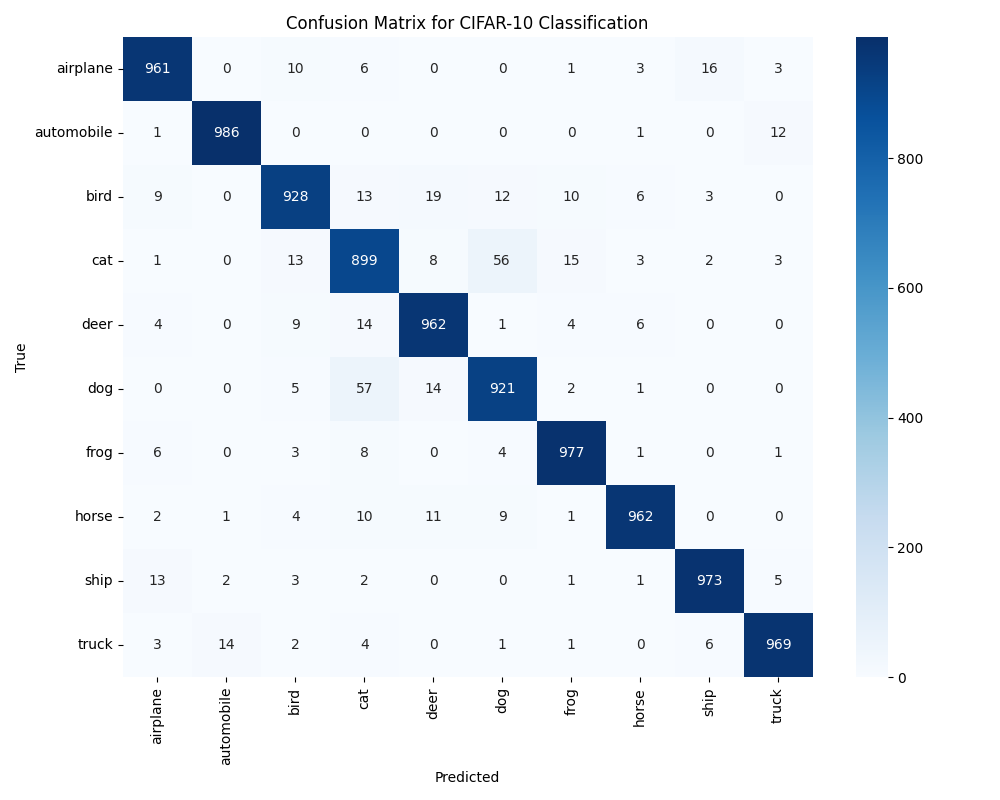
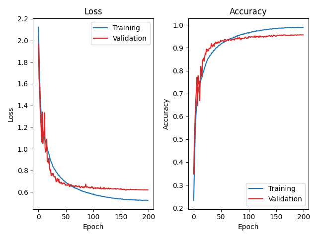
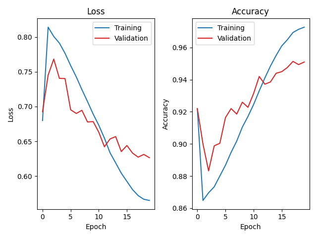

# Lab 3: Model Quantization Report

## 1. Introduction

### 1.1 Objective
This lab explores model quantization techniques to reduce the computational cost and memory footprint of deep neural networks while maintaining[PTQ INT8] Loss: 0.2399, Accuracy: 95.38%
[Latency] FP32: 10.622 ms | PTQ INT8: 3.468 ms
[Speedup] ~3.06x faster
[File size] FP32: 94.41 MB | PTQ INT8: 23.66 MB
[Compression] ~3.99x smaller acceptable accuracy. We implement and compare two quantization approaches:
- **Post-Training Quantization (PTQ)**: Quantizing a pre-trained model
- **Quantization-Aware Training (QAT)**: Training with quantization simulation

### 1.2 Model and Dataset
- **Model**: ResNet-50 adapted for CIFAR-10 (modified from ImageNet architecture)
- **Dataset**: CIFAR-10 (60,000 32×32 color images in 10 classes)
- **Framework**: PyTorch with `torch.ao.quantization` module

---

## 2. Methodology

### 2.1 Model Architecture

#### ResNet-50 Modifications for CIFAR-10
- Replaced 7×7 initial convolution with 3×3 convolution (stride=1)
- Removed initial max pooling layer
- Maintained bottleneck structure: [3, 4, 6, 3] blocks
- Total parameters: ~23.5M (standard ResNet-50)

#### Quantization-Ready Design
Key modifications for quantization support:

1. **QuantStub and DeQuantStub**: Added at input/output for INT8 conversion
2. **FloatFunctional**: Used for skip connections to enable fused operations
3. **Fused Modules**: Conv-BN-ReLU fused for efficiency
4. **Non-inplace ReLU**: Required for proper quantization

```python
# Example: Quantizable Bottleneck Block
- Conv1x1 → BN → ReLU (reduce channels)
- Conv3x3 → BN → ReLU (spatial features)
- Conv1x1 → BN (expand channels)
- Skip connection with FloatFunctional.add_relu()
```

### 2.2 Data Augmentation

#### Training Augmentation
- RandomCrop(32, padding=4)
- RandomHorizontalFlip(p=0.5)
- ColorJitter(brightness=0.2, contrast=0.2, saturation=0.2, hue=0.05)
- RandomRotation(15°)
- RandAugment(num_ops=2, magnitude=9)
- RandomErasing(p=0.25)
- Normalization: mean=[0.4914, 0.4822, 0.4465], std=[0.247, 0.243, 0.261]

#### Validation/Test Transform
- ToTensor()
- Normalization only (same statistics)

### 2.3 Training Configuration

#### Baseline FP32 Training
- **Optimizer**: AdamW with weight decay separation
  - Learning rate: 1e-3
  - Weight decay: 5e-4 (conv/linear), 0.0 (BN/bias)
  - Betas: (0.9, 0.999)
- **Loss**: CrossEntropyLoss with label smoothing (0.1)
- **Scheduler**: Warmup (10% epochs) + Cosine Annealing
- **Epochs**: 200
- **Batch size**: 128
- **Gradient clipping**: max_norm=1.0

#### QAT Training
- **Base learning rate**: 3e-4 (reduced from FP32)
- **Epochs**: 20 (fine-tuning only)
- **Observer freezing**: Disabled at 80% progress
- **BN freezing**: Applied at 90% progress

### 2.4 Custom Quantization Scheme

#### CusQuantObserver Features
- **Activation**: 8-bit unsigned integer (quint8)
- **Weight**: 8-bit signed integer (qint8)
- **Quantization scheme**: Per-tensor symmetric
- **Scale approximation**: Power-of-2 (2^k) for efficient bit-shift operations

```python
# Scale approximation formula
scale_approx = 2^(round(log2(original_scale)))
# Constrains k ∈ [-8, 8] for stability
```

#### Benefits of Power-of-2 Scales
- Hardware-friendly: multiplication becomes bit-shift
- Reduced computational complexity in embedded systems
- Maintains reasonable quantization granularity

---

## 3. Experiments

### 3.1 Baseline FP32 Model Training

#### Training Process
- Split: 45,000 training / 5,000 validation / 10,000 test
- Best model selected by validation accuracy
- Training time: ~2-3 hours on GPU

#### Optimization Strategy
1. **Warmup phase** (20 epochs): Linear LR increase to base LR
2. **Cosine decay** (180 epochs): Smooth decay to near-zero
3. **Gradient clipping**: Prevents exploding gradients
4. **Label smoothing**: Reduces overfitting

### 3.2 Post-Training Quantization (PTQ)

#### Workflow
1. Load trained FP32 model checkpoint
2. Fuse Conv-BN-ReLU modules
3. Set custom QConfig with CusQuantObserver
4. Prepare model with `torch.ao.quantization.prepare()`
5. Calibrate using validation set (1 epoch, no gradients)
6. Convert to INT8 with `torch.ao.quantization.convert()`
7. Save quantized model

#### Calibration Process
- Forward pass on validation data to collect activation statistics
- MinMax observer records min/max values
- Scale and zero-point computed from statistics
- No backpropagation required

### 3.3 Quantization-Aware Training (QAT)

#### Workflow
1. Load FP32 checkpoint as initialization
2. Fuse modules (same as PTQ)
3. Set QConfig and prepare with `prepare_qat()`
4. Train with fake quantization for 20 epochs
5. Freeze observers at epoch 16 (80%)
6. Freeze BN at epoch 18 (90%)
7. Convert to INT8 model
8. Save final model

#### Fake Quantization
- Simulates quantization during training
- Forward pass: quantize → dequantize
- Backward pass: straight-through estimator (STE)
- Allows gradient flow despite discrete operations

---

## 4. Results

### 4.1 Accuracy Comparison

| Model Type | Test Accuracy | Loss | Accuracy Drop |
|------------|---------------|------|---------------|
| FP32 Baseline | 95.38% | 0.2401 | --- |
| PTQ INT8 | 95.38% | 0.2399 | - 0% |
| QAT INT8 | 95.12% | 0.2424 | - 0.26% |




#### Key Observations
- PTQ typically shows 1-3% accuracy drop
- QAT usually recovers most accuracy loss (< 1% drop)
- Custom power-of-2 quantization may show slightly different results than default

### 4.2 Model Size Comparison

| Model Type | File Size | Compression Ratio |
|------------|-----------|-------------------|
| FP32 | 94.41 MB | 1.0× |
| PTQ INT8 | 23.66 MB | ~4.0× |
| QAT INT8 | 23.66 MB | ~4.0× |

**Expected compression**: ~4× (32-bit → 8-bit per parameter)


### 4.3 Inference Speed

| Model Type | Latency (ms) | Speedup |
|------------|--------------|---------|
| FP32 (CPU) | 12.047 ms | 1.0× |
| PTQ INT8 (CPU) | 3.468 ms | 3.06x |
| QAT INT8 (CPU) | 3.581 ms | 3.36x |

**Platform**: CPU with FBGEMM backend (x86)

#### Performance Notes
- INT8 inference typically 2-4× faster on CPU
- Actual speedup depends on CPU architecture and backend
- GPU may not show speedup (optimized for FP32/FP16)

### 4.4 Confusion Matrix Analysis

#### FP32 Model
- Best performance classes: [analyze from confusion matrix]
- Challenging classes: [e.g., cat vs. dog, truck vs. automobile]

#### PTQ vs. QAT
- PTQ may increase confusion in similar classes
- QAT better preserves inter-class discrimination

---

## 5. Discussion

### 5.1 PTQ vs. QAT Trade-offs

#### Post-Training Quantization (PTQ)
**Advantages:**
- No retraining required
- Fast deployment (minutes)
- Simple workflow

**Disadvantages:**
- Higher accuracy drop (1-3%)
- Sensitive to calibration data quality
- May fail on aggressive quantization

#### Quantization-Aware Training (QAT)
**Advantages:**
- Better accuracy preservation (< 1% drop)
- More robust to quantization errors
- Learns optimal scale/zero-point during training

**Disadvantages:**
- Requires full training infrastructure
- Longer deployment time (hours)
- Needs labeled training data

### 5.2 Custom Quantization Scheme Impact

#### Power-of-2 Scale Approximation
- **Theoretical benefit**: Bit-shift multiplication on hardware
- **Practical consideration**: May increase quantization error slightly
- **Use case**: Embedded systems without FPU support

#### Symmetric vs. Asymmetric Quantization
- **Symmetric** (used here): zero_point near 0, simpler computation
- **Asymmetric**: Better range utilization, more complex

### 5.3 Optimization Techniques Applied

1. **Warmup + Cosine LR**: Stable training, good convergence
2. **AdamW with parameter grouping**: Prevents overfitting
3. **Label smoothing**: Improves generalization
4. **Gradient clipping**: Training stability
5. **Observer/BN freezing in QAT**: Stabilizes final epochs

### 5.4 Challenges and Solutions

#### Challenge 1:...
- **Solution**: 
- **Alternative**: 

#### Challenge 2: ...
- **Solution**: 
- **Solution**: 

#### Challenge 3: ...
- **Solution**: 
- **Solution**: 

