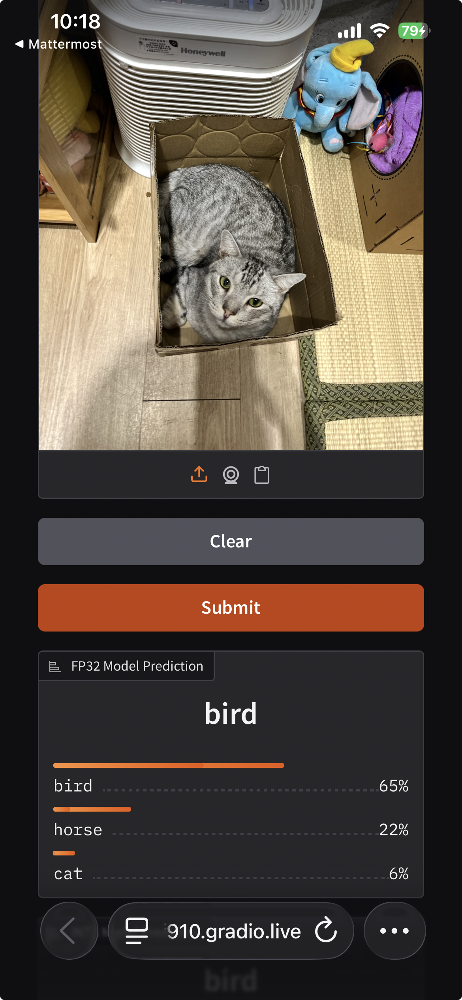
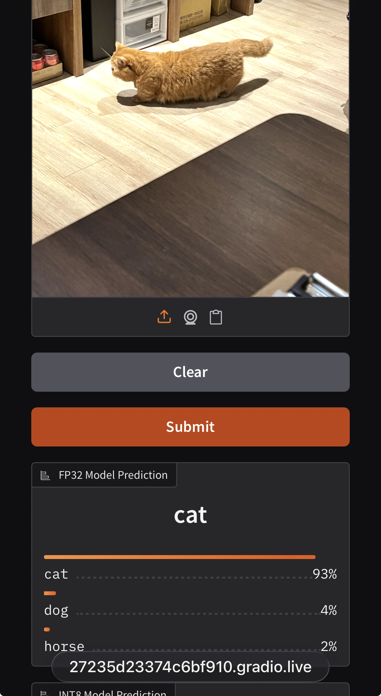
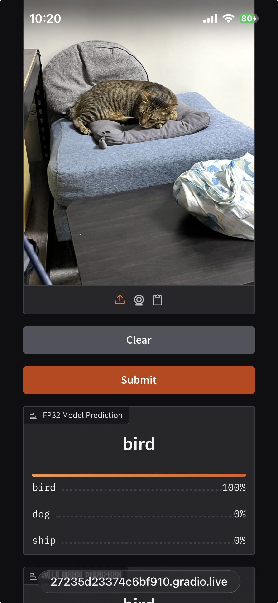
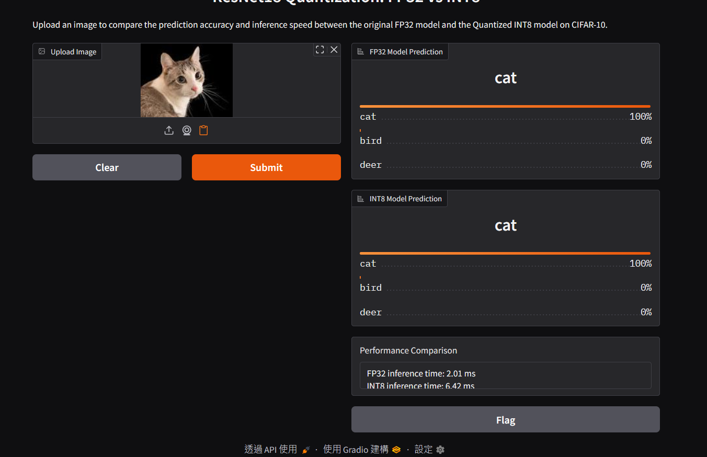

# Lab 5 - Homework Report

## Topic 3: Report (25%)

### 1. Public Gradio Interface Test (10%)
> **Requirement**: In the public Gradio interface URL, use other devices (such as iPad, mobile phone, etc.) to test, upload at least three pictures in the interface and perform input operations, and then take screenshots of the operation results and put them in the report.

Below are the screenshots taken from a mobile device testing the public Gradio interface.

| Test Case 1 | Test Case 2 | Test Case 3 |
| :---: | :---: | :---: |
|  |  |  |

---

### 2. FP32 vs INT8 Comparison (10%)
> **Requirement**: Explain what difference you observed between FP32 and INT 8 in the compare_fp32_int8 function, and attach relevant evidence.

#### Evidence
The following screenshot demonstrates the inference comparison output:

#### Observation and Analysis

| Model Type | Inference Time | Speedup (FP32/INT8) |
| :--- | :--- | :--- |
| **FP32** | 2.01 ms | - |
| **INT8** | 6.42 ms | **0.31x** |

**Observation:**
Contrary to the typical expectation that quantization accelerates inference, the observed **INT8 inference speed (6.42 ms) is slower than FP32 (2.01 ms)** in this specific environment.

In the compare_fp32_int8 function, I compute the top-3 class probabilities for both FP32 and INT8 models and measure their inference time. In the Gradio UI, I display the top-3 predictions of each model and show a textual summary of the latency and speedup.

**Reasoning:**
This performance degradation (0.31x speedup) suggests that the hardware used for this test may not natively support INT8 acceleration instructions. When hardware support is absent, the overhead of quantizing and dequantizing data (or handling INT8 operations via software emulation) can outweigh the benefits of reduced memory bandwidth, leading to increased latency.

---

### 3. Lab Feedback (5%)
> **Requirement**: Thoughts and suggestions for this lab (at least 10 words).

This lab provided a comprehensive overview of the model deployment pipeline. I learned how to bridge the gap between training and production by converting models to ONNX and applying quantization. The hands-on experience with Gradio was particularly valuable, as it demonstrated how quickly we can build interactive demos to showcase our work to others. The distinction between static and dynamic quantization was also a key takeaway.
