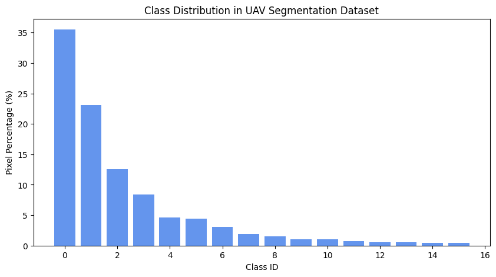
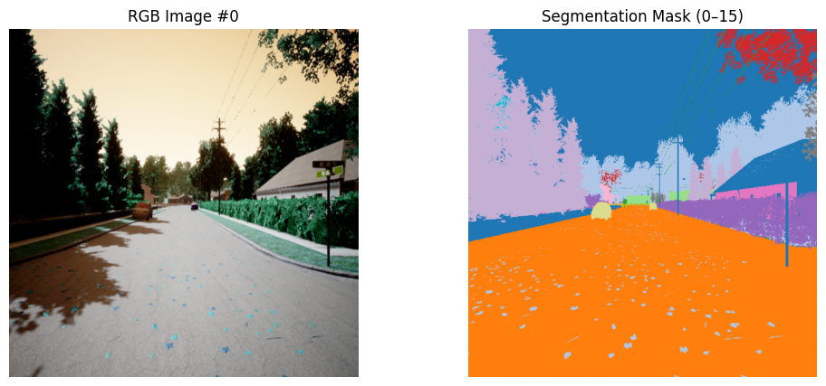
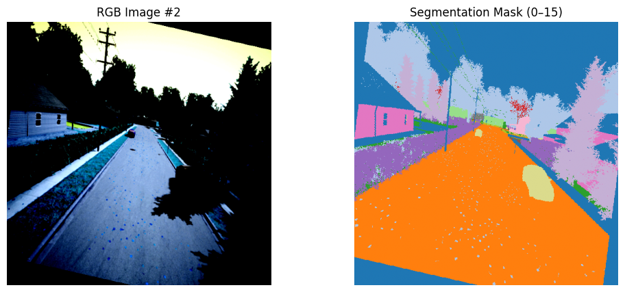
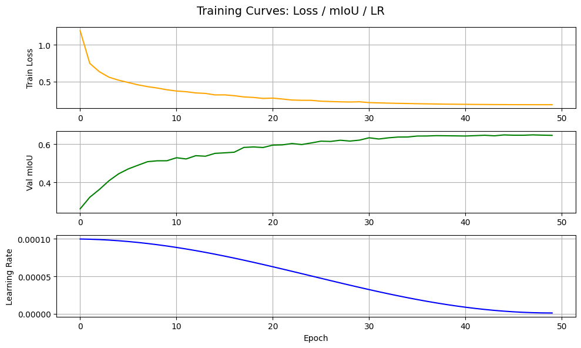
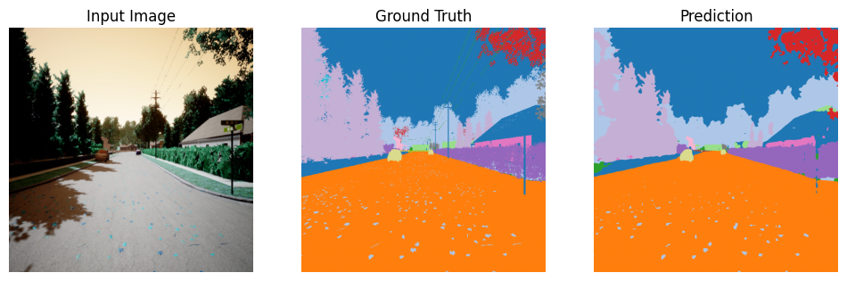

# 1. Data Analysis & Preprocessing (15%)

## 1.1 Dataset Exploration (5%)

### 1.1.1 Dataset Structure

本次作業使用課程提供的 **UAV semantic segmentation** 資料集。
透過 `get_datasets("data")` 載入後，資料結構如下：

* **Training set**：

  * 4000 張 RGB 影像（`train/imgs`）
  * 4000 張對應的 segmentation masks（`train/masks`）
* **Test set**：

  * 1000 張 RGB 影像（`test/imgs`），無標註，由 Kaggle 負責評分
* 每一張 mask 為單通道影像，像素值介於 `0–15`，對應 **16 個語意類別**

為確認標註類別是否完整，在程式中對前 50 張 mask 進行掃描：

```text
Unique classes found in first 50 masks: [0, 1, 2, ..., 15]
Total unique classes detected: 16
✅ Confirmed: All 16 semantic classes (0–15) are present in the dataset.
```

接著對 **全部 4000 張 training 影像** 統計「每一類別至少出現一次的影像數」，得到：

| Class ID | #Images that contain this class |
| :------: | ------------------------------: |
|     0    |                            4000 |
|     1    |                            3999 |
|     2    |                            3325 |
|     3    |                            3975 |
|     4    |                            3459 |
|     5    |                            3285 |
|     6    |                            3572 |
|     7    |                            2382 |
|     8    |                            3176 |
|     9    |                            2529 |
|    10    |                            2011 |
|    11    |                            1939 |
|    12    |                            2831 |
|    13    |                            3043 |
|    14    |                            1399 |
|    15    |                            1782 |

由此可見：

* **class 0、1 幾乎存在於所有影像中**，屬於高頻類別
* 類別 ID 較大的類別（例如 14、15）在影像中較少出現
* 資料集具有明顯的 **長尾類別不平衡**，這對模型訓練與 mIoU 評分都會造成影響

---

### 1.1.2 Data Visualization

為了更直觀理解類別分佈，我以 100 張 training masks 的像素標註，
統計每一類別的像素數量並換算為百分比，繪製像素層級的 class distribution：

> **Figure 1. Class Distribution in UAV Segmentation Dataset (pixel-level)**
> 橫軸為 class ID（0–15），縱軸為該類別像素數占全部像素的百分比。
> 

從圖中可以看到：

* **class 0 的像素比例最高**，其次為 class 1、2 等常見背景／前景類別
* ID 較大的類別像素比例明顯偏低，與前述「每類別出現影像數」一致
* 整體呈現高度不平衡，後續 loss 設計與 error analysis 都必須考慮這個現象

此外，為了確認標註與場景內容是否對齊，我從 training set 中擷取數張樣本，
將 **原始 RGB 影像** 與對應的 **語意 mask** 並排顯示：

> **Figure 2. Example RGB image and its 16-class semantic mask**
> 

> 

從視覺化結果可以確認：

* 道路、天空、建築、樹木等主要結構在 mask 中皆有合理標註
* 不同類別以不同顏色顯示，方便後續進行 qualitative error analysis

---

## 1.2 Image Preprocessing & Augmentation (10%)

### 1.2.1 Preprocessing Pipeline

所有影像前處理均在 `dataset.py` 中實作，
由 `UAVdataset` 負責讀檔，`JointTransform` 與 `test_transform` 處理幾何與強度操作。

**(1) Training set**

訓練資料的前處理由 `JointTransform` 完成，流程如下：

1. **讀取與格式**

   * 影像：`PIL.Image.open(...).convert("RGB")`
   * 標註：`PIL.Image.open(...)` 單通道灰階，像素值為類別 ID

2. **幾何操作（影像與 mask 同步）**

   * Random Horizontal Flip（機率 0.5）

     ```python
     if random.random() < 0.5:
         img  = F.hflip(img)
         mask = F.hflip(mask)
     ```
   * Random Rotation（角度範圍 −10° ~ +10°）

     * 影像使用雙線性插值
     * mask 使用最近鄰插值，避免類別 ID 被插值污染

3. **Color Jitter（僅作用於影像）**

   ```python
   self.jitter = T.ColorJitter(
       brightness=0.3, contrast=0.3,
       saturation=0.3, hue=0.05
   )
   img = self.jitter(img)
   ```

4. **Resize 與張量轉換**

   * 影像與 mask 一律 resize 到 `512×512`
   * 影像以 `F.to_tensor` 轉為 `[C,H,W]`、浮點數 `[0,1]`
   * mask 轉為 `torch.int64` tensor，保留類別索引

5. **Normalization（ImageNet 統計量）**

   ```python
   img = F.normalize(
       img,
       mean=[0.485, 0.456, 0.406],
       std=[0.229, 0.224, 0.225],
   )
   ```

   此設定與 ResNet 在 ImageNet 預訓練時所用一致，有利於充分利用 encoder 的先驗特徵。

**(2) Test set**

測試資料不做增強，只使用 `test_transform`：

```python
test_transform = T.Compose([
    T.Resize((512, 512)),
    T.ToTensor(),
    T.Normalize(mean=[0.485, 0.456, 0.406],
                std=[0.229, 0.224, 0.225]),
])
```

如此可確保：

* train / test 前處理在統計分佈上是一致的
* 不會在推論階段引入隨機性，方便與 Kaggle 評分對齊

---

### 1.2.2 Data Augmentation Strategy

本專案的資料增強策略如下：

* **幾何增強**

  * Random Horizontal Flip
  * Random Rotation（小角度）
    ➜ 模擬 UAV 不同飛行方向與姿態，增加視角多樣性

* **光照增強**

  * ColorJitter（亮度、對比、飽和度、色相）
    ➜ 模擬不同天氣與曝光條件，增加對陰影與高光的魯棒性

* **解析度統一**

  * 所有訓練與測試影像 resize 至 `512×512`
  * 推論後再依個別原圖尺寸 `(600×800)` 進行最近鄰放大，以確保與原圖 pixel-level 對齊

這些增強在後續實驗中被證明能穩定提升模型泛化性，也為 error analysis 提供更可靠的比較基準。

---

# 2. Model Selection & Training (20%)

## 2.1 Model Architecture (10%)

本作業共實作三個主要模型，作為從 baseline 到改進版本的對照：

1. **Model A – DeepLabV3 + ResNet-50（Baseline）**
2. **Model B – DeepLabV3 + ResNet-101（效果最好）**
3. **Model C – UNet++ + ResNet-101**

### 2.1.1 DeepLabV3 + ResNet-50（Baseline）

Baseline 使用 `torchvision.models.segmentation.deeplabv3_resnet50` 建立：

```python
model = deeplabv3_resnet50(weights=None, num_classes=NUM_CLASSES)
```

選用原因：

* DeepLabV3 內含 **ASPP (Atrous Spatial Pyramid Pooling)**，
  能同時擷取多尺度語意特徵，適合處理道路、建築、天空等大尺度結構。
* ResNet-50 結構成熟、參數量適中，能在合理訓練時間內提供穩定 baseline。

### 2.1.2 DeepLabV3 + ResNet-101

在確認 pipeline 正確後，將 backbone 改為 **ResNet-101**：

* 主要差異在 encoder 更深，具有較強的高階語意特徵表達能力。
* 其他設定（ASPP、decoder、loss）與 baseline 相同，用以純粹比較 backbone 深度的影響。

### 2.1.3 UNet++ + ResNet-101

模型採用 `segmentation_models_pytorch` 中的 UNet++：

```python
model = smp.UnetPlusPlus(
    encoder_name="resnet101",
    encoder_weights="imagenet",
    in_channels=3,
    classes=NUM_CLASSES,
).to(DEVICE)
```

架構特點：

* **Encoder**：ResNet-101 + ImageNet 預訓練權重
* **Decoder**：UNet++ 的 dense skip connections

  * 相較原始 U-Net，UNet++ 在 encoder–decoder 之間引入多層 skip path
  * 有助於在上採樣過程中融合更多低階幾何細節與高階語意資訊
* **Segmentation head**：1×1 convolution 將 decoder 輸出投影到 16 類 logits

設計目標是改善 DeepLabV3 在細節邊界與小物體上的不足，同時保持 ResNet-101 的高階語意能力。

---

## 2.2 Loss Function & Optimization (5%)

### 2.2.1 Loss Function

**DeepLabV3 系列（Model A/B）**

* 損失函數採用標準的 **CrossEntropyLoss**：

  ```python
  criterion = nn.CrossEntropyLoss()
  loss = criterion(outputs, masks)
  ```

* 主要負責 pixel-wise 多類別分類，提供穩定的 baseline。

**UNet++（Model C）**

在 `train_unetpp.py` 中，為了緩解類別不平衡問題，採用 **Hybrid Loss**：

```python
ce_loss   = nn.CrossEntropyLoss()
dice_loss = smp.losses.DiceLoss(mode="multiclass")

def hybrid_loss(pred, target):
    return 0.5 * ce_loss(pred, target) + 0.5 * dice_loss(pred, target)
```

考量如下：

* CrossEntropyLoss：對整體語意分類負責
* DiceLoss：直接對區域重疊率（IoU 相關）優化，對小面積類別較敏感
* 兩者各佔 0.5 權重，在實驗中帶來穩定的收斂行為

### 2.2.2 Optimizer & Learning Rate Schedule

**DeepLabV3 / 初版 U-Net++**

* Optimizer：`Adam(lr=1e-4)`
* Scheduler：`CosineAnnealingLR(optimizer, T_max=EPOCHS, eta_min=1e-6)`

**最終 U-Net++（分組學習率）**

在 `train_unetpp.py` 中，對 encoder 和 decoder 採用不同學習率：

```python
LR_ENCODER = 1e-5
LR_DECODER = 1e-4

optimizer = optim.Adam([
    {"params": model.encoder.parameters(),           "lr": LR_ENCODER},
    {"params": model.decoder.parameters(),           "lr": LR_DECODER},
    {"params": model.segmentation_head.parameters(), "lr": LR_DECODER},
])

scheduler = CosineAnnealingLR(optimizer, T_max=EPOCHS, eta_min=1e-6)
```

理由：

* 預訓練的 ResNet-101 encoder 已具有強大特徵，不宜大幅更新 → 使用較小學習率
* decoder 與 segmentation head 需從頭學習任務特化表示 → 使用較大學習率
* CosineAnnealingLR 讓學習率在整個訓練期間平滑衰減，前期探索、後期微調皆較穩定

---

## 2.3 Training Process & Hyperparameters (5%)

### 2.3.1 Dataset Split & DataLoader

* 使用 `random_split` 將 4000 張 training 影像切成：

  * **Train**：3200 張（80%）
  * **Validation**：800 張（20%）

```python
total_size = len(train_ds)
val_size   = int(0.2 * total_size)
train_size = total_size - val_size
train_subset, val_subset = random_split(train_ds, [train_size, val_size])
```

* DataLoader 設定：

```python
train_loader = DataLoader(train_subset, batch_size=8,
                          shuffle=True,  num_workers=4)
val_loader   = DataLoader(val_subset,   batch_size=8,
                          shuffle=False, num_workers=4)
```

### 2.3.2 Hyperparameters

* Device：`cuda`（若無 GPU 則自動 fallback 至 `cpu`）
* Batch size：8
* Epochs：

  * DeepLabV3 / 早期 U-Net++：50
  * 最終 U-Net++ 實驗：**100**
* Optimizer：Adam
* Scheduler：CosineAnnealingLR (`T_max=EPOCHS`, `eta_min=1e-6`)

> 下圖示意 U-Net++ 訓練過程中 **Train Loss / Val mIoU / Learning Rate** 的變化（摘自 `training_log_unetpp.json`）：
> 

可觀察到：

* Loss 由約 1.01 逐步下降至約 0.17～0.19；
* Validation mIoU 由 0.26 起步，最終收斂在約 **0.66**；
* Cosine scheduler 讓學習率從 `1e-4` 平滑衰減到接近 `1e-6`。

### 2.3.3 Overfitting Prevention

為避免過擬合，本實驗採用以下策略：

1. 資料增強（Flip、Rotation、ColorJitter）增加樣本多樣性
2. 使用 ImageNet 預訓練 encoder 並搭配較小學習率微調
3. 使用 CosineAnnealingLR 在後期降低學習率，防止 loss 震盪
4. 每個 epoch 在 validation set 上計算 mIoU，僅在 mIoU 上升時更新「最佳模型權重」：

   * DeepLabV3：`best_deeplabv3.pth`
   * UNet++：`best_unetpp.pth`

---

# 3. Experiment & Results (15%)

## 3.1 Comparison of Different Approaches (10%)

### 3.1.1 Quantitative Results

綜合三個模型的 validation mIoU 與 Kaggle Public mIoU，如下表所示：

| Model        | Backbone   | Loss                  | Epochs | **Best Val mIoU**（val set） | **Kaggle Public mIoU** |
| ------------ | ---------- | --------------------- | ------ | -------------------------- | ---------------------- |
| A. DeepLabV3 | ResNet-50  | CrossEntropy          | 50     | 約 0.64                     | 0.5068                 |
| B. DeepLabV3 | ResNet-101 | CrossEntropy          | 50     | 約 0.66                     | **0.5809**             |
| C. UNet++    | ResNet-101 | 0.5·CE + 0.5·DiceLoss | 100    | 約 **0.661**（最高點）           | 0.5471                 |

重點觀察：

* **DeepLabV3-ResNet50 → DeepLabV3-ResNet101**：

  * 僅改變 backbone 深度，validation mIoU 約從 0.64 提升到 0.66，
  * Kaggle Public mIoU 則由 0.5068 提升到 **0.5809**，提升約 0.074。

* **UNet++-ResNet101**：

  * validation mIoU 最高約 **0.661**，略高於 DeepLabV3-ResNet101；
  * 但在 Kaggle 測試集上得到 **0.5471**，低於 0.5809，
    顯示在本設定下 UNet++ 對測試分佈較敏感，也較受類別不平衡影響。

整體來看，**DeepLabV3-ResNet101 是本作業中泛化性能最佳的模型**。

---

### 3.1.2 Qualitative Results

從輸出可視化來看（以 `Input / Ground Truth / Prediction` 三圖比較）：

* **DeepLabV3-ResNet50**

  * 能正確分出道路、天空、建築物等大區塊，但邊界較模糊。
* **DeepLabV3-ResNet101**

  * 大面積區域更乾淨，邊界穩定，遠處建物與天空過渡自然。
* **UNet++-ResNet101**

  * 邊界最為銳利，尤其是道路轉彎、行道樹輪廓等細節表現最好，
  * 但在某些小型物體或長尾類別上容易整塊被錯分，導致 mIoU 被拉低。

示意圖（檔名依你實際輸出）：



---

## 3.2 Error Analysis & Model Improvements (5%)

### 3.2.1 Error Analysis

1. **類別不平衡**

   * 由「每類別出現影像數」與像素分佈可知，class 0、1 為高頻，
     class 14、15 等為明顯長尾類別。
   * 在 mIoU（所有類別平均）評分下，只要少數類別 IoU 很低，就會明顯拉低總分。
   * UNet++ 雖然邊界較精細，但對這些長尾類別的誤判仍然嚴重。

2. **細長物體與陰影區錯誤**

   * 三個模型都會在陰影區、亮暗交界處出現 misclassification。
   * 細長物體（電線桿、路燈）易被併入背景或鄰近類別。

3. **Pipeline 實作錯誤的影響**

   * 早期曾將輸出 mask 固定為 `1024×1024`，未依原圖 `(600×800)` 動態 resize，
     導致 mask 與影像完全錯位，mIoU 掉到約 0.26。
   * 亦曾出現 train/test transform 不一致（test 多做或少做 Normalize），
     造成分佈偏移，Public score 僅約 0.27。
   * 修正為 **動態依原圖尺寸 resize** 並統一 Normalize 後，
     分數才回升到 0.50 以上，顯示 pipeline 正確性極為關鍵。

### 3.2.2 Possible Improvements

根據上述錯誤與行為，未來可以嘗試：

1. **處理長尾類別**

   * Class-weighted CrossEntropy（依 pixel frequency 設定權重）
   * Focal Loss / Tversky Loss，強調 hard examples 與小物體
   * 調整 CE / DiceLoss 比例，增加對小面積類別的權重

2. **提高輸入解析度**

   * 由 `512×512` 提升到 `768×768` 或以上，
     或採用 coarse-to-fine 微調，以改善窄小物體的辨識。

3. **更細緻的 learning rate 策略**

   * 搭配 warm-up + cosine decay，避免訓練初期破壞預訓練 encoder 表徵。

4. **Test-Time Augmentation (TTA)**

   * 對單張測試影像進行多尺度與翻轉推論，再對 logits 做平均或投票，
     有機會在不重新訓練的情況下提升 1–2% mIoU。

5. **建立固定的 pipeline 檢查項**

   * 每次更動程式後，先檢查：

     * `img.shape` 與 `pred.shape` 是否與原圖一致
     * 單張影像的 encode–decode–RLE–decode 是否能復原
   * 避免再因尺寸錯位或 transform 出錯而白白失分。

---

## 3.3 Summary of Findings

* **Backbone 深度很重要**：
  DeepLabV3 的 backbone 從 ResNet-50 換成 ResNet-101，即可帶來約 7% 的 Kaggle mIoU 提升。

* **Decoder 結構與 loss 設計同樣關鍵**：
  UNet++-ResNet101 在 validation mIoU 上略優於 DeepLabV3-ResNet101，
  但因長尾類別與泛化問題，在 Public mIoU 上仍落後。

* **Pipeline 正確性不可忽略**：
  輸出尺寸、前處理一致性、RLE 編碼等「工程細節」若有錯誤，
  造成的分數損失往往遠大於模型架構帶來的差距。

本次作業建立了一條完整、可重複的 UAV semantic segmentation pipeline，
並透過一系列實驗驗證了：

1. 資料前處理與 augmentation 對模型穩定性的重要性；
2. backbone 深度與 decoder 結構對 segmentation 效能的影響；
3. 類別不平衡與實作細節對 mIoU 的實際影響與改善方向。
