# Midterm Project Report

## 1. Project Overview
This project consists of two main themes:
1.  **Theme 1**: Rock Paper Scissors Classification.
2.  **Theme 2**: Face Emotion Recognition.

The goal is to train and evaluate different deep learning models (ResNet18, EfficientNet-B0, and a custom SimpleCNN) on these datasets and analyze their performance.

---

## 2. Theme 1: Rock Paper Scissors Classification

### 2.1 Dataset Introduction
The dataset consists of images belonging to 3 classes: **Rock**, **Paper**, and **Scissors**.
*   **Training Set**: 2,520 images
*   **Validation Set**: 33 images
*   **Test Set**: 372 images

**Paper**

**Rock**

**Scissors**

### 2.2 Model Architecture & Training Method
We implemented three models:
*   **ResNet18**: A residual learning framework to ease the training of networks that are substantially deeper than those used previously. Pre-trained on ImageNet.
*   **EfficientNet-B0**: A model that balances network depth, width, and resolution for better efficiency. Pre-trained on ImageNet.
*   **SimpleCNN**: A custom 3-layer Convolutional Neural Network with Max Pooling and Fully Connected layers.

#### Hyperparameters
*   **Epochs**: 10
*   **Batch Size**: 32
*   **Learning Rate**: 0.001
*   **Optimizer**: Adam
*   **Loss Function**: CrossEntropyLoss

### 2.3 Experimental Results

| Model | Best Validation Accuracy |
| :--- | :--- |
| ResNet18 | 100.00% |
| EfficientNet-B0 | 100.00% |
| SimpleCNN | 100.00% |

#### Training Curves
**ResNet18**
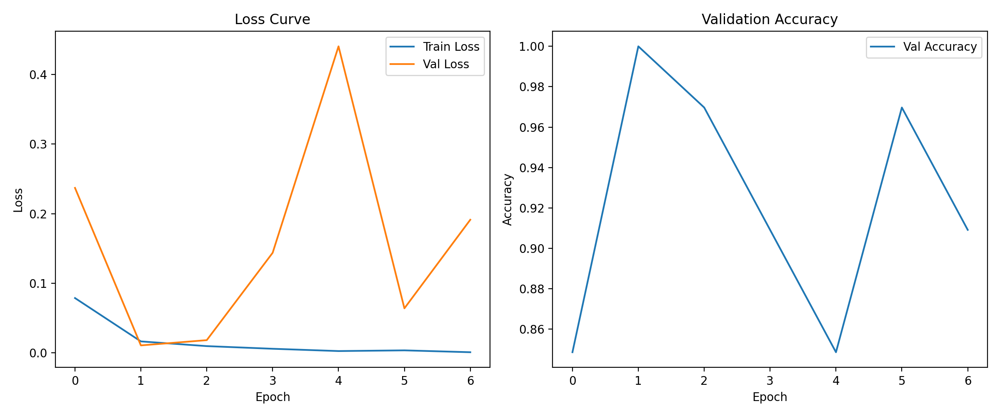

**EfficientNet-B0**
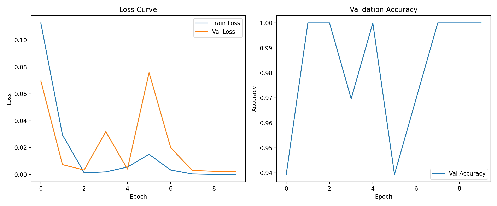

**SimpleCNN**
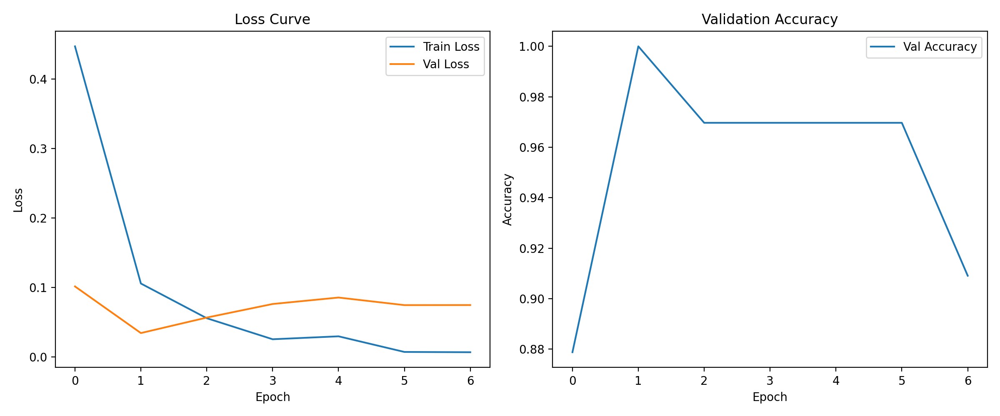

#### Confusion Matrix
**ResNet18**
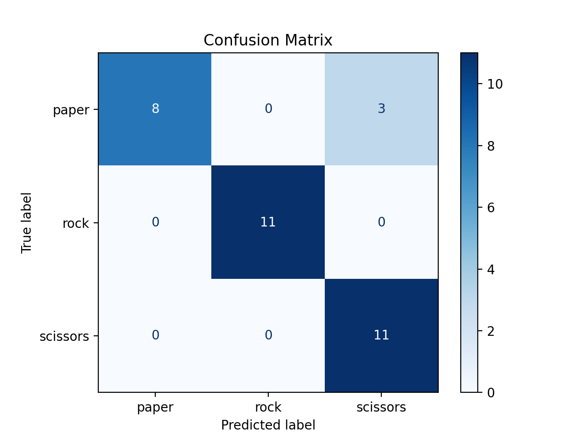

**EfficientNet-B0**
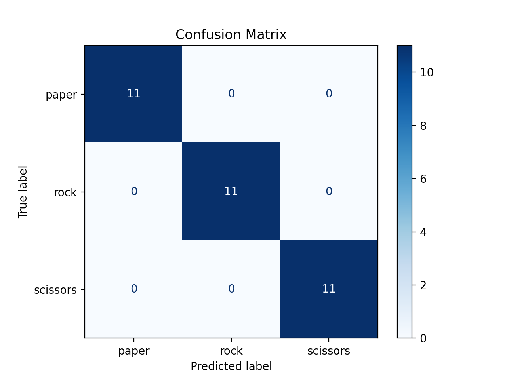

**SimpleCNN**
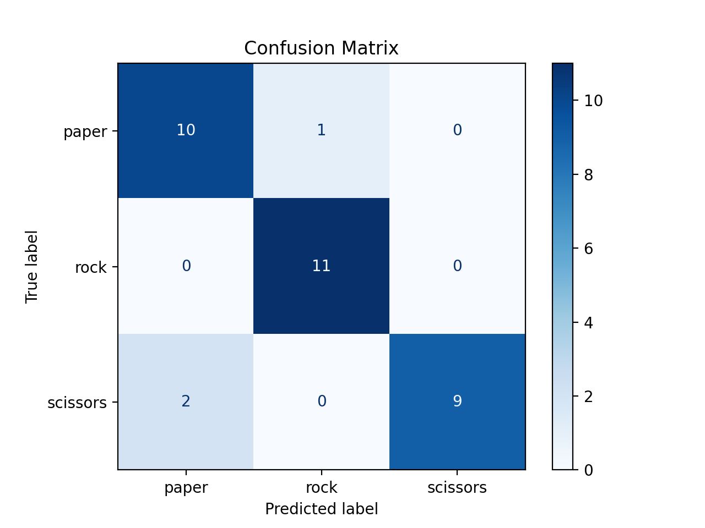

### 2.4 Model Performance Analysis
All three models achieved near-perfect accuracy (100%) on the validation set. This suggests that the "Rock Paper Scissors" dataset is relatively simple with distinct features for each class, or the validation set is small and easy to classify. Even the simple custom CNN was able to learn the features effectively.

### 2.5 Conclusion & Future Improvements
For this specific task, all models performed exceptionally well. Future improvements could involve testing on a more challenging or diverse dataset to better differentiate model performance.

---

## 3. Theme 2: Face Emotion Recognition

### 3.1 Dataset Introduction
The dataset consists of facial images categorized into 7 emotions: **Angry, Disgust, Fear, Happy, Neutral, Sad, Surprise**.
*   **Training Set**: 39,822 images
*   **Validation Set**: 4,978 images
*   **Test Set**: 4,979 images

**Angry**

**Disgust**

**Fear**

**Happy**

**Neutral**

**Sad**

**Surprise**

### 3.2 Model Architecture & Training Method
The same three architectures were used as in Theme 1, but adapted for 7 classes.

#### Hyperparameters
*   **Epochs**: 20 (Early stopping with patience=5)
*   **Batch Size**: 64
*   **Learning Rate**: 0.001
*   **Optimizer**: Adam
*   **Loss Function**: CrossEntropyLoss

### 3.3 Experimental Results

| Model | Best Validation Accuracy |
| :--- | :--- |
| ResNet18 | ~78.9% |
| EfficientNet-B0 | ~79.1% |
| SimpleCNN | ~66.7% |

#### Training Curves
**ResNet18**
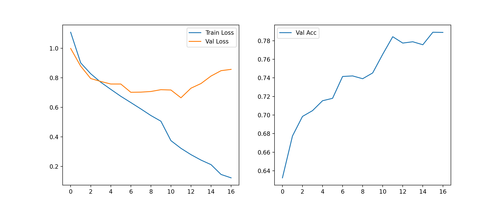

**EfficientNet-B0**
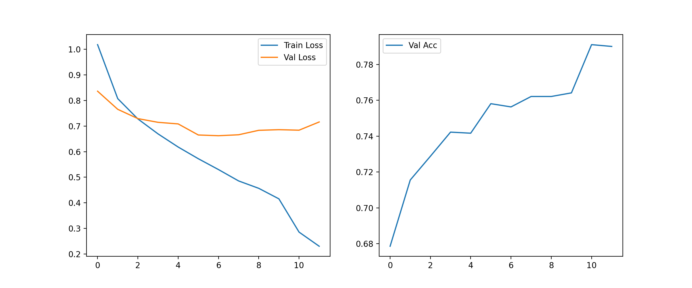

**SimpleCNN**
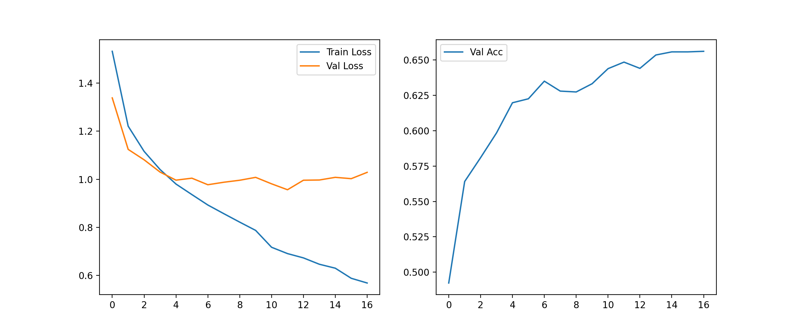

#### Confusion Matrix
**ResNet18**
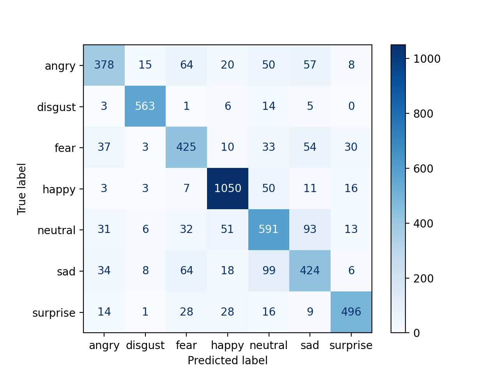

**EfficientNet-B0**

**SimpleCNN**
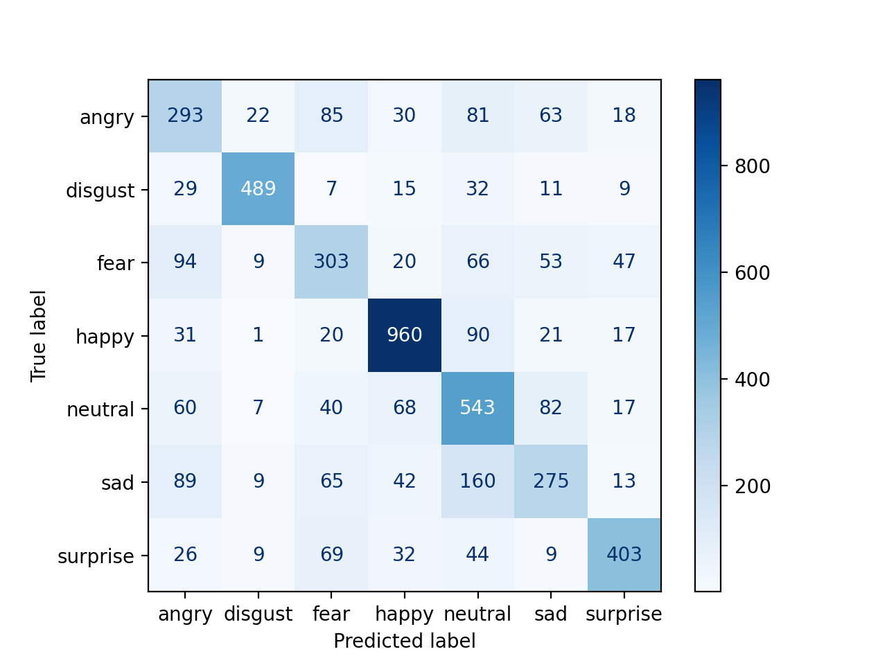

### 3.4 Model Performance Analysis
*   **Model Comparison**: EfficientNet-B0 slightly outperformed ResNet18, while both significantly outperformed the SimpleCNN. This highlights the advantage of using pre-trained, sophisticated architectures for complex tasks like emotion recognition.
*   **Error Analysis**: Confusion matrices show that certain emotions (e.g., "fear" vs "surprise", or "sad" vs "neutral") are more easily confused than others.

### 3.5 Conclusion & Future Improvements
*   **Data Augmentation**: More aggressive augmentation (rotation, flipping, color jitter) could help generalization.
*   **Hyperparameter Tuning**: Experimenting with different learning rates, schedulers, or optimizers (e.g., SGD with momentum).
*   **Regularization**: Adding Dropout or Weight Decay to prevent overfitting, which was observed in the training curves (training loss decreasing while validation loss plateaus).
*   **Ensemble Methods**: Combining predictions from multiple models could improve overall accuracy.

---

## 4. Overall Conclusion
In this project, we successfully trained and evaluated models for two different computer vision tasks. Theme 1 demonstrated that simple tasks can be solved with basic models, while Theme 2 showed the necessity of advanced architectures for more complex pattern recognition. EfficientNet-B0 proved to be the most effective model overall.
