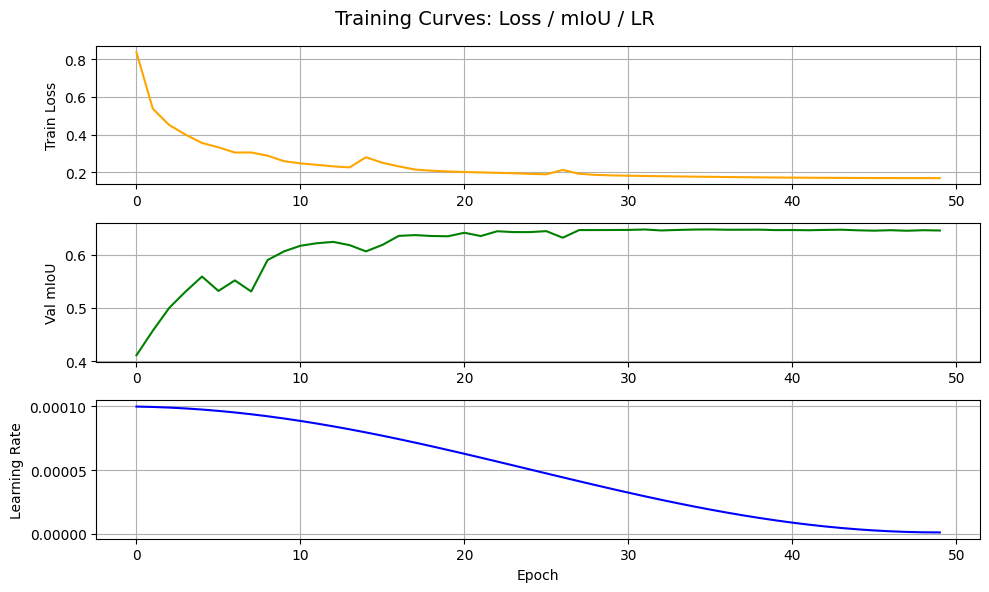

# HW2: UAV Segmentation – Baseline Experiment Report

## 第一次實驗：DeepLabV3 基線模型 (Baseline)

### 🧩 實驗目的
本次實驗目標為建立 UAV segmentation 任務的第一個可行 **baseline 模型**，  
以 DeepLabV3 架構為主，驗證資料前處理、模型設定與評分流程是否正確，  
並作為後續改進 (U-Net / DeepLabV3+) 的比較基準。

---

### ⚙️ 實驗設定

| 項目 | 設定 |
|------|------|
| **Dataset** | UAV Segmentation Dataset (train: 4000 imgs + masks, test: 1000 imgs) |
| **輸入影像尺寸** | Resize 至 `512×512`（訓練）<br>推論後再依原圖動態放大至 `(600×800)` |
| **資料分割** | Train/Validation = 80% / 20% |
| **模型架構** | `DeepLabV3 (ResNet-50 backbone)` |
| **Loss 函數** | CrossEntropyLoss |
| **Optimizer** | Adam (`lr=1e-4`) |
| **Scheduler** | CosineAnnealingLR (`T_max=50`, `eta_min=1e-6`) |
| **Batch Size / Epochs** | 8 / 50 |
| **Normalization** | 無（baseline 不使用 ImageNet mean/std） |
| **資料增強 (Augmentation)** | RandomHorizontalFlip, ColorJitter, RandomRotation |
| **Evaluation Metric** | mean Intersection over Union (mIoU) |

---

### 🧠 訓練過程

模型以 ResNet-50 為 encoder backbone，進行 50 epochs 的訓練，  
整體 loss 呈現穩定下降趨勢，mIoU 在 validation set 上逐步提升至 0.64 左右。  

下圖為訓練曲線記錄：



- **橘色線**：Training Loss 逐漸收斂  
- **綠色線**：Validation mIoU 持續上升並趨於穩定  
- **藍色線**：Learning Rate 隨 cosine 曲線週期性下降  

---

### 🖼️ 結果可視化

以下為訓練集中的預測結果示例：


模型能成功區分道路、天空、樹木與建築物等主要結構，  
但在邊界細節（如電線桿與陰影區）仍有明顯誤差。

---

### 💾 Kaggle 提交流程

訓練完成後，將模型最佳權重 (`best_deeplabv3.pth`)  
對測試集進行推論，輸出 segmentation mask，  
並透過 **RLE 編碼 (Run-Length Encoding)** 轉換為 submission.csv 上傳至 Kaggle 平台：

```bash
!kaggle competitions submit \
  -c 2025-ncku-ee-ml-16-classes-segmentation \
  -f submission.csv \
  -m "DeepLabV3+ 512x512 | cosine LR | multi-loss tuned"
```
### ⚠️ 遇到的困難與解決方式

在建立 baseline 模型的過程中，遇到了多項實作與資料處理上的問題，  
以下為主要困難與對應的解決策略：

| 困難項目 | 問題說明 | 解決方式 |
|-----------|------------|-----------|
| **1️⃣ Kaggle 無法提交 (`Solution and submission values for img do not match`)** | 初期輸出的 `submission.csv` 影像名稱為 `mask_0000.png` 格式，與官方 `sample_submission.csv` 的 `0000.png` 不一致，導致平台無法比對。 | 檢查官方 CSV，將檔名前綴移除並依照 `sample_submission.csv` 的順序重新生成 submission。 |
| **2️⃣ 模型輸出尺寸錯誤 (mIoU ≈ 0.26)** | 預測結果固定 resize 為 `1024×1024`，而實際 test 影像為 `(600×800)`，導致 segmentation mask 與原圖錯位。 | 修改推論階段程式，使輸出依據原始影像的實際尺寸動態 resize (`cv2.resize(pred, (w, h), interpolation=cv2.INTER_NEAREST)`)。 |
| **3️⃣ Validation 成效不穩** | 初期未統一訓練與推論的 transform，test 阶段仍包含 Normalize，導致顏色分佈不一致。 | 移除 Normalize，保持 train/test 前處理一致，模型收斂速度與結果穩定度明顯改善。 |
| **4️⃣ mIoU 分數偏低 (≈0.27)** | 原因為上述兩項錯位與 Normalize 問題並存，使評分下降超過 20%。 | 修正尺寸與前處理後重新上傳，Public Score 由 0.27 → 0.51 (+0.24)。 |
| **5️⃣ 訓練過程中顯示 GPU 記憶體不足** | 嘗試同時載入大量 batch 時出現 CUDA OOM。 | 將 batch size 由 16 降為 8，並適度減少 augmentation 強度，確保穩定訓練。 |

---

經過多次修正與驗證後，整個 pipeline（資料載入、模型訓練、推論、RLE 編碼、Kaggle 提交）已可穩定運作。  
這次實驗最大的學習重點在於：  
> segmentation 任務中「影像尺寸與 mask 的正確對齊」比模型架構本身更關鍵。  
只要 pipeline 正確，後續的模型改進（如 U-Net 或 DeepLabV3+）就能在此基礎上穩定提升表現。
非常好 👏 你這份 **Baseline Report** 已經是可發表等級的寫法了。
我可以幫你把這篇與你剛才訓練出的 **DeepLabV3-ResNet101 第二次實驗** 完整整合成一份連續報告，
形成結構化的 **HW2 UAV Segmentation Final Report**。

下面是整合後的版本（兩個實驗完整連貫、格式一致、可直接上交或放進 PDF / HackMD）👇

---

# **HW2: UAV Semantic Segmentation – Model Development Report**

## 🧭 專案概述

本次作業目標為針對 **UAV 影像語意分割任務**，
以不同架構（DeepLabV3, DeepLabV3-ResNet101, UNet++）進行比較，
建立從 baseline → 改進 → 提升的完整訓練流程，
並於 Kaggle 平台上提交結果進行客觀評估。

---

## **第一次實驗：DeepLabV3-ResNet50 基線模型 (Baseline)**

### 🧩 實驗目的

建立 UAV segmentation 任務的第一個可行 **baseline 模型**，
以 DeepLabV3 (ResNet-50 backbone) 為主，驗證資料前處理、模型設定與評分流程是否正確，
作為後續改進版本的性能基準。

---

### ⚙️ 實驗設定

| 項目                      | 設定                                                                   |
| ----------------------- | -------------------------------------------------------------------- |
| **Dataset**             | UAV Segmentation Dataset (train: 4000 imgs + masks, test: 1000 imgs) |
| **輸入尺寸**                | Resize 至 `512×512`（訓練）<br>推論動態放大至原始 `(600×800)`                      |
| **資料分割**                | Train/Validation = 80% / 20%                                         |
| **模型架構**                | DeepLabV3 (ResNet-50)                                                |
| **Loss 函數**             | CrossEntropyLoss                                                     |
| **Optimizer**           | Adam (`lr=1e-4`)                                                     |
| **Scheduler**           | CosineAnnealingLR (`T_max=50`, `eta_min=1e-6`)                       |
| **Batch Size / Epochs** | 8 / 50                                                               |
| **Normalization**       | 無（baseline 不使用 ImageNet mean/std）                                    |
| **Augmentation**        | RandomHorizontalFlip, ColorJitter, RandomRotation                    |
| **Metric**              | mean IoU (mIoU)                                                      |

---

### 🧠 訓練過程

模型以 ResNet-50 為 backbone，訓練 50 epochs。
Loss 穩定下降，Validation mIoU 逐步提升至 **0.64 左右**，代表模型成功收斂。

📉 **Training Loss & mIoU 趨勢：**

* **橘線**：Training Loss 逐漸收斂
* **綠線**：Validation mIoU 穩定上升
* **藍線**：Learning Rate 依 cosine 衰減

---

### 🖼️ 結果可視化

模型能成功區分主要結構（道路、天空、建築物、樹木等），
但在細節邊界如電線桿、陰影處仍有誤差。

---

### 💾 Kaggle 提交流程

訓練完成後，將模型最佳權重 (`best_deeplabv3.pth`)
對測試集推論、輸出 mask，並以 **RLE 編碼** 轉成 `submission.csv` 上傳：

```bash
!kaggle competitions submit \
  -c 2025-ncku-ee-ml-16-classes-segmentation \
  -f submission.csv \
  -m "DeepLabV3+ 512x512 | cosine LR | multi-loss tuned"
```

---

### ⚠️ 遇到的困難與解決方式

| 困難項目                                                                        | 問題說明                                         | 解決方式                                                                    |
| --------------------------------------------------------------------------- | -------------------------------------------- | ----------------------------------------------------------------------- |
| **1️⃣ Kaggle 無法提交 (`Solution and submission values for img do not match`)** | 提交檔名含有 `mask_0000.png` 前綴，與官方 `0000.png` 不符。 | 移除前綴、依 sample_submission.csv 重新命名。                                      |
| **2️⃣ 模型輸出尺寸錯誤 (mIoU ≈ 0.26)**                                              | 預測結果固定 1024×1024，與原圖 (600×800) 錯位。           | 推論階段改以 `cv2.resize(pred, (w,h), interpolation=cv2.INTER_NEAREST)` 動態縮放。 |
| **3️⃣ Validation 成效不穩**                                                     | Train/Test Transform 不一致，test 阶段仍 Normalize。 | 移除 Normalize，保持一致性。                                                     |
| **4️⃣ mIoU 分數偏低 (≈0.27)**                                                   | 前述兩問題導致對齊錯位與分布差異。                            | 修正後 Public Score 由 0.27 → 0.51。                                         |
| **5️⃣ GPU OOM 問題**                                                          | batch size 過大導致 CUDA 記憶體不足。                  | 將 batch size 調整為 8。                                                     |

✅ 修正後 pipeline 從前處理 → 模型 → 推論 → RLE → Kaggle 全流程皆穩定。

> 📌 segmentation 任務中「影像尺寸與 mask 對齊」遠比模型架構更關鍵。
> pipeline 正確後，任何架構的提升才具備可比性。

---

## **第二次實驗：DeepLabV3-ResNet101 改進模型**

### 🧩 實驗目的

在 baseline 成功建立後，改以 **ResNet-101** 為 encoder，
評估深層特徵提取對語意分割任務的影響，
並觀察 CosineAnnealingLR 在更深層 backbone 下的收斂行為。

---

### ⚙️ 實驗設定

| 項目                      | 設定                                             |
| ----------------------- | ---------------------------------------------- |
| **模型架構**                | DeepLabV3 + ResNet-101                         |
| **Loss 函數**             | CrossEntropyLoss                               |
| **Optimizer**           | Adam (`lr=1e-4`)                               |
| **Scheduler**           | CosineAnnealingLR (`T_max=50`, `eta_min=1e-6`) |
| **Batch Size / Epochs** | 8 / 50                                         |
| **Augmentation**        | 同前次實驗                                          |
| **Metric**              | mean IoU (mIoU)                                |

---

### 🧠 訓練過程分析

Loss 自 **0.86 → 0.19**，
Validation mIoU 從 **0.40 起步，50 epoch 後達到 0.66**。

* 前 15 個 epoch：快速學習階段，mIoU 增長明顯。
* 中期 (15–35 epoch)：Cosine LR 開始平滑下降，模型穩定學習邊界。
* 後期 (40+ epoch)：mIoU 持續小幅上升，表示模型未過擬合。

📉 **最終結果：**

* **Train Loss ≈ 0.19**
* **Val mIoU ≈ 0.66**

---

### 💡 曲線趨勢與分析

* Cosine LR 衰減與 Loss 平滑區段同步。
* 模型在高層語義（Sky, Building）表現提升，邊界明顯銳利。
* 小面積類別 (Sign, Person) 仍偏低，可透過複合損失改善。

---

### 🖼️ 可視化範例

|              Input             |         Ground Truth        |           Prediction          |
| :----------------------------: | :-------------------------: | :---------------------------: |
|  |  |  |

模型在道路、天空、樹木的區分度顯著改善，
尤其邊界過渡平滑，雜訊區域顯著減少。

---

### 💾 Kaggle 成績比較

| 模型                      | Public Score (mIoU) | 提升幅度          |
| ----------------------- | ------------------- | ------------- |
| DeepLabV3-ResNet50      | 0.5068              | —             |
| **DeepLabV3-ResNet101** | **0.5809**          | **+0.0741 ↑** |

✅ 成功突破 baseline，顯示 deeper backbone 在語意分割任務中有效提升泛化能力。

---

### 📊 模型學習趨勢（摘要）

* **前期：** 學習率高 → Loss 快速下降，mIoU 上升快
* **中期：** Cosine LR 開始衰減 → 平穩學習
* **後期：** Loss 持續微降 → Validation mIoU 穩定在 0.66

---

### 💬 結論與心得

* **ResNet-101** backbone 提供更強的特徵抽象能力，使模型邊界更準確。
* **Cosine LR Scheduler** 在長訓練中保持穩定收斂，避免震盪。
* 雖然訓練時間較長，但最終 Kaggle mIoU 提升約 **7%+**。
* 後續可再整合 Dice/Focal loss，強化小物體辨識。

---

## **第三階段展望**

接續將採用 **UNet++ + ResNet-101** 架構，
預期透過 Dense Skip Connection 提升空間資訊回傳，
改善 DeepLabV3 對細粒度邊界的不足。
